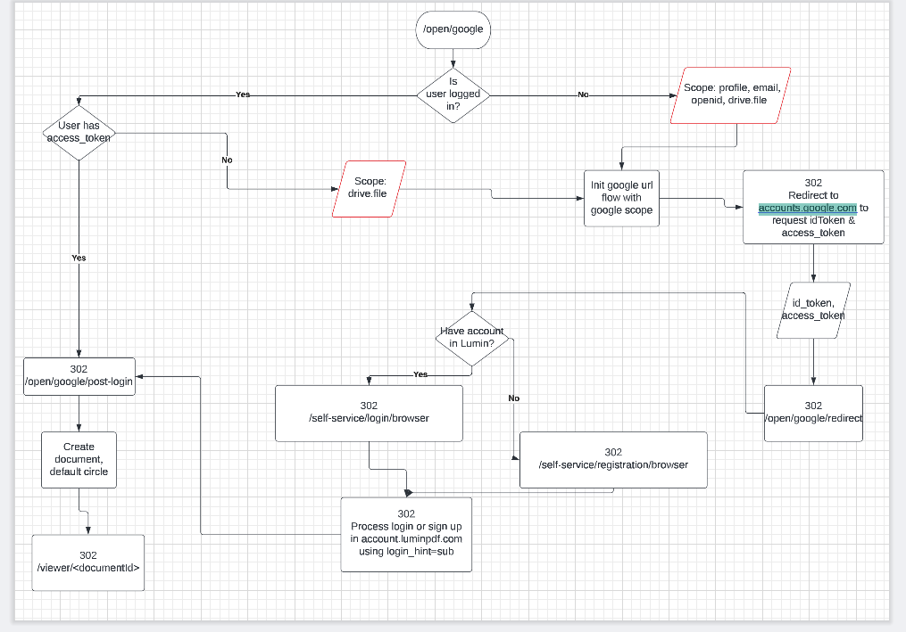

# Open Google instruction

## Architecture


## Delete identity in kratos server
```sh
# Found identity_id when look at api `whoami` at https://account-staging.luminpdf.com after logged in.

# If you are logged in, call the api in browser
https://account-staging.luminpdf.com/open/google/delete-identities

# Otherwise
https://account-staging.luminpdf.com/open/google/delete-identities/<identity_id>
```