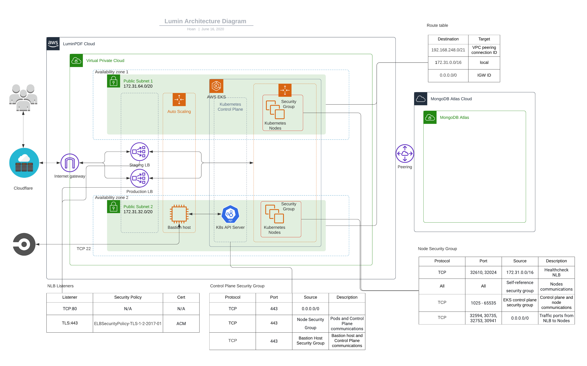

<a href="https://gitmoji.dev">
  
</a>

# Lumin Web Viewer 2.0

[](https://app.circleci.com/pipelines/bitbucket/nitrolabs/lumin-web-viewer-2.0)


Lumin sits on top of [WebViewer](https://www.pdftron.com/webviewer), a powerful JavaScript-based PDF Library that's part of the [PDFTron PDF SDK](https://www.pdftron.com). Built in React, WebViewer UI provides a slick out-of-the-box responsive UI that interacts with the core library to view, annotate and manipulate PDFs that can be embedded into any web project.


# Prequisites

Before you begin, make sure your development environment includes [Node.js](https://nodejs.org/en/).

## Clone project

```
git clone --recurse-submodules git@bitbucket.org:nitrolabs/lumin-web-viewer-2.0.git
```

# How to start project

## Install

```bash
pnpm install
```

## Run

```bash
pnpm start
```

## Build

```bash
pnpm run build
```

## Build and start container with Docker
```sh
make start environment=<branch_name>
# For example: make start environment=pwa
```

## Run unit test
```bash
pnpm run test-jest
```

## Download core
```bash
pnpm run download-webviewer
```
or
```
git submodule update --init --recursive
```

### **Note:**
When we upgrade PDFTron Core version on [Lumin Web Core](https://bitbucket.org/nitrolabs/lumin-web-core/src/master/), please update submodule.
```
git submodule update --remote
```
## Convert TTF to WOFF2 icomoon font
---
1. Copy *icomoon.ttf* and *icomoon.svg* was generated from https://icomoon.io/app/ to `assets/fonts/icomoon/`
2. Run this command
```bash
pnpm run generate-woff2
```


# Project structure

```
src/
  apis/                 - APIs exposed in myWebViewer.getInstance()
  apollo/               - Apollo Setup
  components/           - React components
  constants/            - JavaScript or CSS constants
  core/                 - APIs from the Core
  event-listeners/      - Listeners for the Core events
  graphql/              - TypeDef of GraphQL queries, mutations and subscriptions
  helpers/              - Reused functions
  redux/                - Redux files for state managing
  lumin-components/     - Lumin Customized components
  screens/              - All app screens
  hooks/                - custom hooks
```
# Environments
There are 4 environments listed below
- *local development* enviroment: Run on developer local machines
- *development* enviroment: Based on `develop` branch, deployed at https://app-dev.luminpdf.com
- *staging* enviroment: Based on `master` branch, deployed at https://app-staging.luminpdf.com
- *pre-production* enviroment: Based on `production` branch, deployed at: https://app-test.luminpdf.com (use Production database but only Lumin team have accessing permission)
- *production* enviroment: Based on `production` branch, deployed at: https://app.luminpdf.com

Development and staging enviroment are authenticated by Github. Contact lead developer and given him Github handle for the invitation.

When you want to add more environment variables, please add them into `settings/development.json`. Remember to inform lead developer to add environment variables to other environments.


# Deployment





# How to upgrade PDFtron version

See [PDFTron Upgrade](./PDFTronUpgrade.md)

# Support

## How to implement Dark Mode feature

 1. If the element color type has not defined in src/constant/lumin-style.scss, you have to create 2 color variables at $themes constant. Example:
 ```scss
 $themes: (
    light: (
        primaryButton: #fff,
    ),
    dark: (
        primaryButton: #000,
    ),
 );
 ```
 2. Change the style css: (component inside the Viewer)
 ```scss
 .button {
     background: #fff,
 }
 ```
 
 to
 ```scss
 .button {
    background: #fff; // keep this line if the component has used outside the Viewer
     @include themify {
         background: themed('primaryButton');
     }
 }
 ```
 
 3. If the component you want to style is outside the App component (<div class="App"></div>), you must add the class name "theme-dark" or "theme-light" at the root of this component. Example:
 ```html
    <Dialog
      open={open}
      onClose={this.handleClose}
      className={`Dialog theme-${isViewer ? themeMode : ''}`}>
      ....
    </Dialog>
 ```

## PDFTron API documentation

See [API documentation](https://www.pdftron.com/documentation/web/guides/ui/apis).


## Docker Support

Docker is mainly supported for production purposes.
However, you can still build and run the Docker image locally:

```sh
docker build -t nitrolabs/lumin-web-viewer .
docker run --rm -p 3000:80 nitrolabs/lumin-web-viewer
```

## Contributing

See [contributing](./CONTRIBUTING.md).

## License

See [license](./LICENSE).


